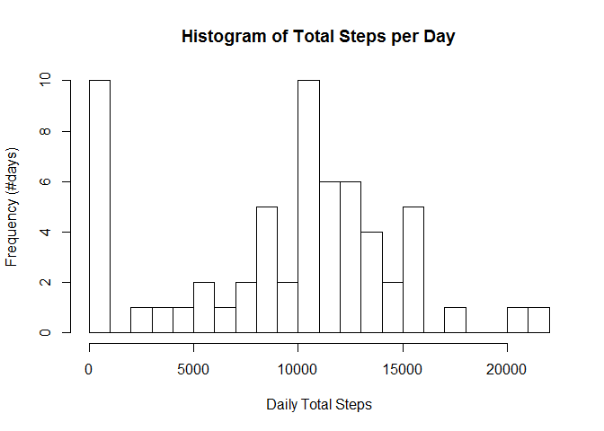
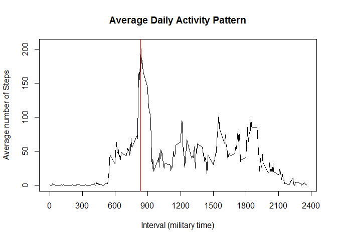
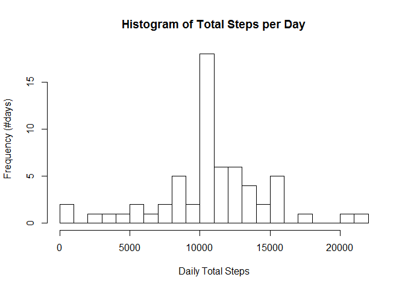
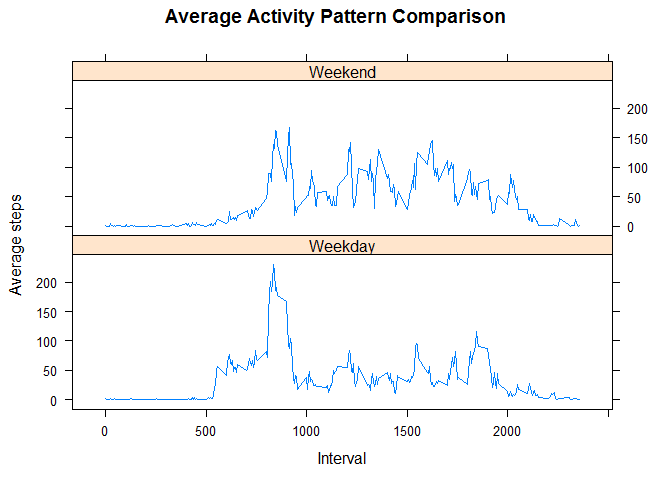

# Reproducible Research: Peer Assessment 1


## Loading and preprocessing the data

Read in csv data contained in activity.zip (file found in Repo).  Convert the
date column from Factor to Date data type.


```r
activity<-read.csv(unzip("activity.zip","activity.csv"))
activity$date<-strptime(activity$date, format="%Y-%m-%d")
```
  
  
## What is mean total number of steps taken per day?

Construct a dataframe to summarize the total steps by day.  

```r
library(plyr)
```

```
## Warning: package 'plyr' was built under R version 3.1.2
```

```r
dailysteps<-ddply(activity,.(date),summarise,Total.Steps=sum(steps,na.rm="T"))
summary(dailysteps)
```

```
##       date                      Total.Steps   
##  Min.   :2012-10-01 00:00:00   Min.   :    0  
##  1st Qu.:2012-10-16 00:00:00   1st Qu.: 6778  
##  Median :2012-10-31 00:00:00   Median :10395  
##  Mean   :2012-10-31 00:25:34   Mean   : 9354  
##  3rd Qu.:2012-11-15 00:00:00   3rd Qu.:12811  
##  Max.   :2012-11-30 00:00:00   Max.   :21194
```

A histogram of this dataframe is then plotted.

```r
hist(dailysteps$Total.Steps,breaks=20,ylab="Frequency (#days)",xlab="Daily Total Steps",
     main="Histogram of Total Steps per Day")
```

 

The mean and median of the daily step totals are calculated.

```r
meanstep<-round(mean(dailysteps[,2]))
medianstep<-median(dailysteps[,2])
```
The mean number of steps per day is 9354.   
The median number of steps per day is 10395.
  
  
  
## What is the average daily activity pattern?

Construct a dataframe to summarize the average steps by interval.


```r
library(plyr)
intervalsteps<-ddply(activity,.(interval),summarise,Ave.Steps=mean(steps,na.rm="T"))
summary(intervalsteps)
```

```
##     interval        Ave.Steps      
##  Min.   :   0.0   Min.   :  0.000  
##  1st Qu.: 588.8   1st Qu.:  2.486  
##  Median :1177.5   Median : 34.113  
##  Mean   :1177.5   Mean   : 37.383  
##  3rd Qu.:1766.2   3rd Qu.: 52.835  
##  Max.   :2355.0   Max.   :206.170
```

A line plot is created from this dataframe.

```r
plot(intervalsteps[,1],intervalsteps[,2],type="l",xlab="Interval (military time)", 
     ylab= "Average number of Steps",main="Average Daily Activity Pattern",xaxp=c(0,2400,8))
maxrow<-which.max(intervalsteps[,2])
maxinterval<-intervalsteps[maxrow,1]
abline(v=maxinterval,col="red")
```

 
  
The interval with the maximum number of steps is 835.
  
  
## Imputing missing values

Calculate the total number of rows with NAs


```r
totalna<-sum(is.na(activity$steps))
```

The total number of row with NAs is 2304.  
  

Construct a dataframe with the NAs replaced with the average steps for the interval.


```r
act_noNA<-activity
for (i in 1:nrow(act_noNA)){
      if (is.na(act_noNA[i,1])) {
            act_noNA[i,1]<-round(intervalsteps[intervalsteps$interval==act_noNA[i,3],2],
                                 digits=0)
      }
}
summary(act_noNA)
```

```
##      steps             date                        interval     
##  Min.   :  0.00   Min.   :2012-10-01 00:00:00   Min.   :   0.0  
##  1st Qu.:  0.00   1st Qu.:2012-10-16 00:00:00   1st Qu.: 588.8  
##  Median :  0.00   Median :2012-10-31 00:00:00   Median :1177.5  
##  Mean   : 37.38   Mean   :2012-10-31 00:25:34   Mean   :1177.5  
##  3rd Qu.: 27.00   3rd Qu.:2012-11-15 00:00:00   3rd Qu.:1766.2  
##  Max.   :806.00   Max.   :2012-11-30 00:00:00   Max.   :2355.0
```

Construct a dataframe to summarize the total steps by day for the NA replaced dataframe


```r
library(plyr)
daystep_noNA<-ddply(act_noNA,.(date),summarise,Total.Steps=sum(steps,na.rm="T"))
summary(daystep_noNA)
```

```
##       date                      Total.Steps   
##  Min.   :2012-10-01 00:00:00   Min.   :   41  
##  1st Qu.:2012-10-16 00:00:00   1st Qu.: 9819  
##  Median :2012-10-31 00:00:00   Median :10762  
##  Mean   :2012-10-31 00:25:34   Mean   :10766  
##  3rd Qu.:2012-11-15 00:00:00   3rd Qu.:12811  
##  Max.   :2012-11-30 00:00:00   Max.   :21194
```

A histogram of this dataframe is then plotted.


```r
hist(daystep_noNA$Total.Steps,breaks=20,ylab="Frequency (#days)",xlab="Daily Total Steps",
     main="Histogram of Total Steps per Day")
```

 

The mean and median of the daily step totals are calculated for the NA replaced data.


```r
mean_noNA<-round(mean(daystep_noNA[,2]),0)
median_noNA<-round(median(daystep_noNA[,2]),0)
meandiff<-mean_noNA - meanstep
mediandiff<-median_noNA - medianstep
options(scipen=999) # turn off scientific notation
```

The mean number of steps is 10766.  This is a 1412 difference from the calculation prior to NA replacement.   
The median number of steps is 10762.  This is a 367 difference from the calculation prior to NA replacement.

## Are there differences in activity patterns between weekdays and weekends?

Add a column for day of the week to the NA replaced dataframe and then recode the column to 
reflect whether the day is a weekday or weekend day.

```r
library(car)
```

```
## Warning: package 'car' was built under R version 3.1.2
```

```r
act_noNA<-mutate(act_noNA, day=weekdays(date))
act_noNA$day<-recode(act_noNA$day,
                     "c('Monday','Tuesday','Wednesday','Thursday','Friday')='Weekday';
                     c('Saturday','Sunday')='Weekend'")
summary(act_noNA)
```

```
##      steps             date                        interval     
##  Min.   :  0.00   Min.   :2012-10-01 00:00:00   Min.   :   0.0  
##  1st Qu.:  0.00   1st Qu.:2012-10-16 00:00:00   1st Qu.: 588.8  
##  Median :  0.00   Median :2012-10-31 00:00:00   Median :1177.5  
##  Mean   : 37.38   Mean   :2012-10-31 00:25:34   Mean   :1177.5  
##  3rd Qu.: 27.00   3rd Qu.:2012-11-15 00:00:00   3rd Qu.:1766.2  
##  Max.   :806.00   Max.   :2012-11-30 00:00:00   Max.   :2355.0  
##      day           
##  Length:17568      
##  Class :character  
##  Mode  :character  
##                    
##                    
## 
```

Construct a dataframe to summarize the average steps by interval and day type for the dataframe above


```r
library(plyr)
intstep_noNA<-ddply(act_noNA,.(interval,day),summarise,Ave.Steps=mean(steps))
summary(intstep_noNA)
```

```
##     interval          day              Ave.Steps      
##  Min.   :   0.0   Length:576         Min.   :  0.000  
##  1st Qu.: 588.8   Class :character   1st Qu.:  2.106  
##  Median :1177.5   Mode  :character   Median : 28.125  
##  Mean   :1177.5                      Mean   : 38.987  
##  3rd Qu.:1766.2                      3rd Qu.: 61.230  
##  Max.   :2355.0                      Max.   :230.356
```

Create a panel plot for the summarized data to compare the activity patterns.


```r
library(lattice)
```

```
## Warning: package 'lattice' was built under R version 3.1.2
```

```r
xyplot(Ave.Steps~interval | day,intstep_noNA,type="l",layout=c(1,2),xlab="Interval", 
       ylab="Average steps", main="Average Activity Pattern Comparison")
```

 
